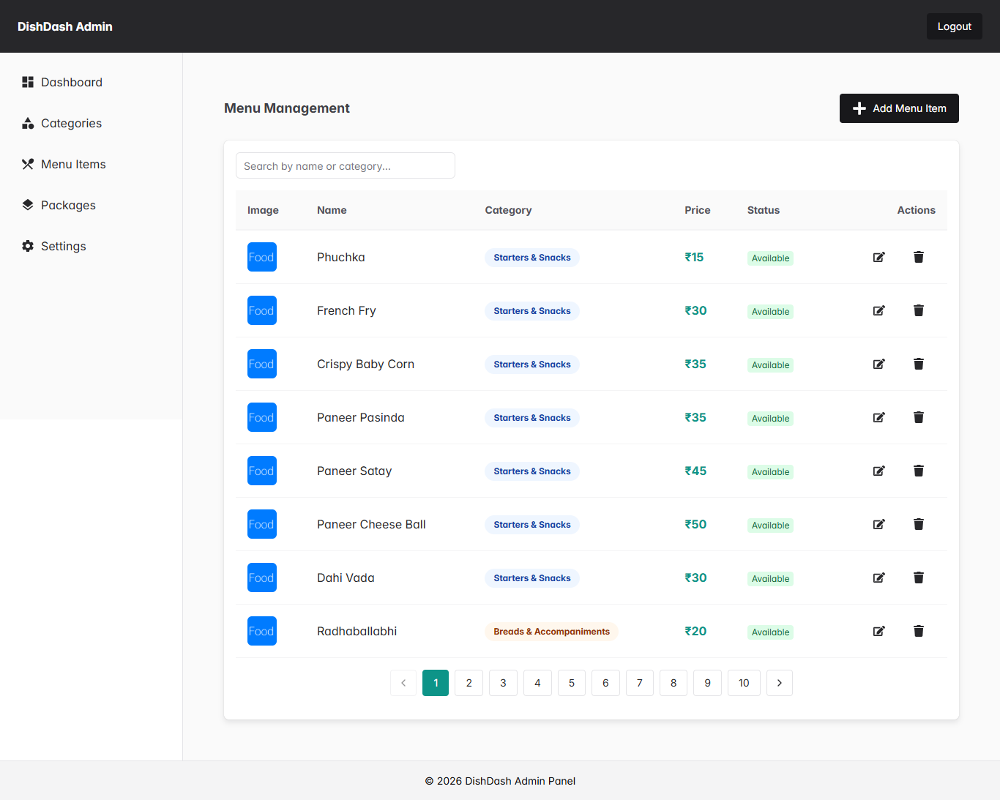
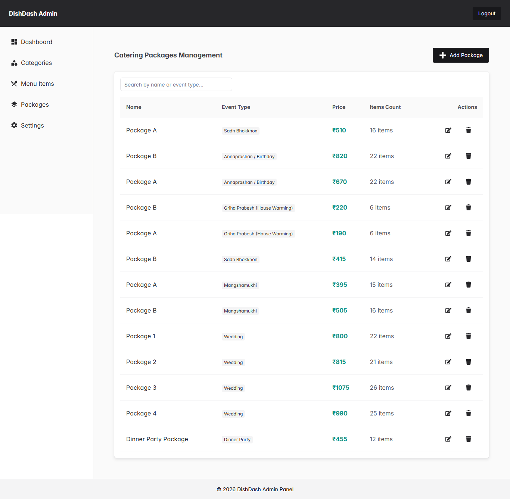
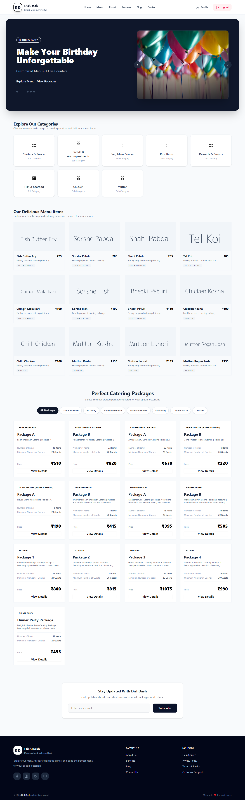
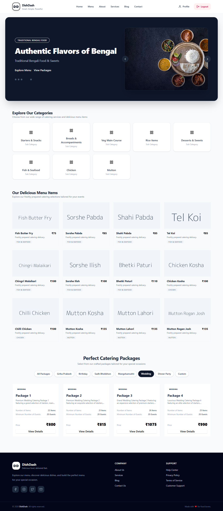
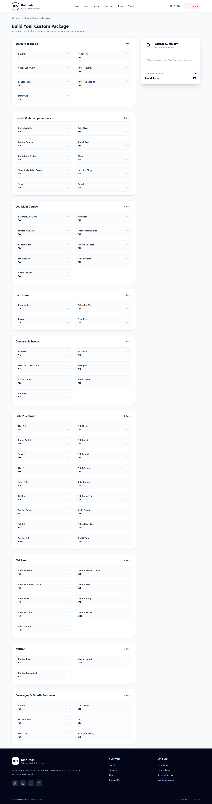

# 🍽️ DishDash - Catering Management System

DishDash is a comprehensive, multi-platform catering management solution designed to streamline event planning, menu customization, and order processing for both customers and administrators.

---
### 1. Admin Panel




### 2. Website





### 3. Mobile App


## 🚀 Project Structure

```text
DishDash/
├── admin-panel/              # Web-based administration dashboard
├── bruno-collection/         # API endpoints collection (.bru files)
│   └── DishDash-API/
├── mobile-app/               # React Native & Expo mobile application
├── screenshot/               # Application mockups and visual assets
├── server/                   # Backend Node.js / Express API server
└── website/                  # Public-facing web application


✨ Features
Mobile App & Website: Cross-platform access for users to explore menus, packages, and submit custom orders.

Interactive Package Builder: Users can select individual menu items to build personalized catering packages and view real-time price estimations.

Admin Dashboard: Manage menu items, track orders, and handle backend operations efficiently.

API Testing: Fully documented endpoint requests via Bruno collection.

🛠️ Tech Stack
Frontend (Mobile): React Native, Expo, Tailwind CSS (NativeWind)

Frontend (Web/Admin): Vite, React, Tailwind CSS

Backend: Node.js, Express.js

Database: MongoDB

API Testing: Bruno

🏁 Getting Started
To run this project locally, clone the repository and set up each module (Server, Mobile App, Website, and Admin Panel) according to their respective configuration files.

Bash
git clone [https://github.com/CheSubhro/DishDash.git](https://github.com/CheSubhro/DishDash.git)
